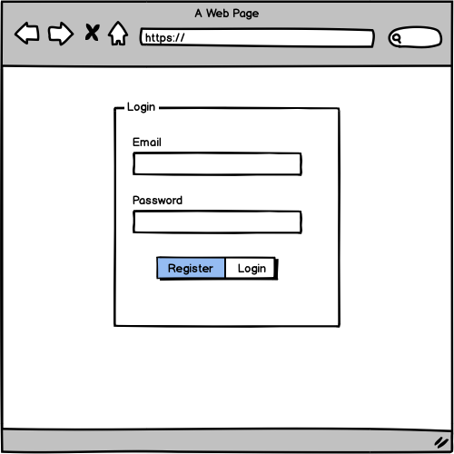
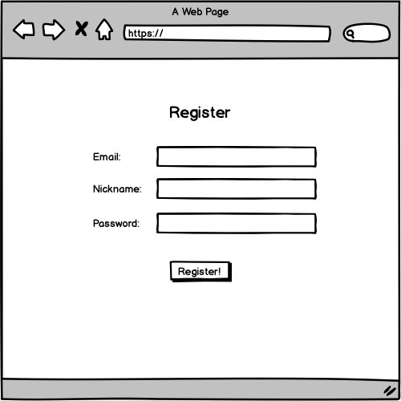
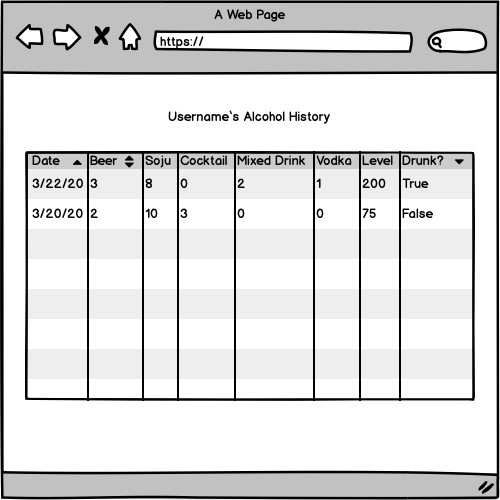
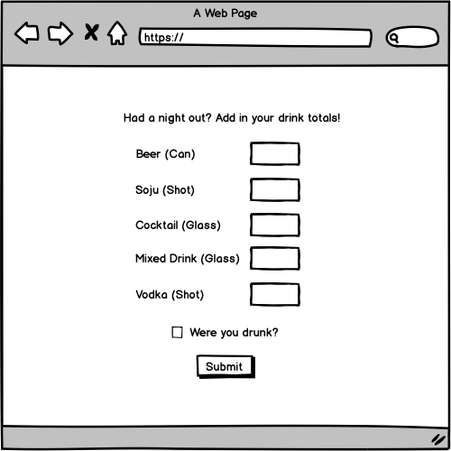
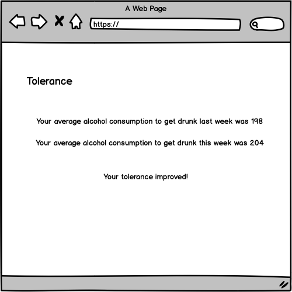

# Alcohometrics  

## Overview
Do you sometimes wonder whether your alcohol tolerance improved from the last time you drank? Alcohometrics is a web app that allows you to keep track of how much you drank the day before and whether you got drunk or not. Users can register and login. Once they are logged in, users can see the list of the all drinks they had over the time they started using this web app. From there, users can input the amount of drinks they had after a night out. The app will store their inputted information in the database, and display whether or not you're alcohol tolerance is improving overtime. 
Potentially, this app will also be able to match users with breweries and within a 5 mile radius with similar drink choices within the same month.

## Data Model
The application will store users, records and drinks

* users can have multiple records for each day they drank (via references)
* each record will have one drinks object that displays the amount of alcohol they drank for each alcohol type (by embedding)

An Example User:

```javascript
{
  username: "alcoholic123",
  email: 
  hash: // a password hash,
  records: // an array of references to Record documents
}
```

An Example Record with Embedded Items:

```javascript
{
  user: // a reference to a User object
  date: //timestamp,
  drinks: { beer_can: 5, soju_shots: 8, vodka_shots: 2},
  drunk: true, 
  alcohol: //Calculate alcohol content consumed from the drinks inputted 
}
```


## [Link to Commented First Draft Schema](db.js) 

## Wireframes
/ - Page to Login 


/register - Page to Register
 

/History - Page for showing all of your alcohol consumption history



/add - Page for adding new alcohol consumption



/tolerance - Page for displaying your tolerance



## Site map


## User Stories or Use Cases
1. As non-registered user, I can register a new account with the site.
2. As a user, I can log in to the site.
3. As a user, I can add how much alcohol I consumed and whether I was drunk.
4. As a user, I can view the history of all my alcohol consumptions in a table. 
5. As a user, I can view whether my tolerance went up or not. 

## Research Topics
* (3 points) Integrate user authentication
    * Use Passport.js for user authentication
* (3 points) Use grunt, gulp, Webpack to use CSS preprocessor, especially interested in using Sass. 
* (2 points) Use Bootstrap for responsive design. 
* (2/4 points) Use React or Angular (Haven't decided yet) for Front-end. Have experience with React so 2 points, Novice to Angular, so 4 points. 
10 points total out of 8 required points.


## [Link to Initial Main Project File](app.js) 

## Annotations / References Used
1. [Passport.js authentication docs](http://passportjs.org/docs) 
2. [Tutorial on Angular](https://angular.io/tutorial) 
3. [Sass Tutorial](https://sass-lang.com/guide)

